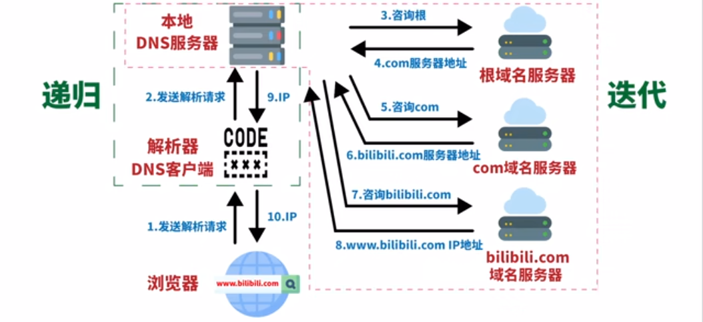

# 在浏览器搜索栏中输入一个url会发生什么

首先浏览器会分析url，确认协议、主机地址、端口、资源路径和参数。

`主机地址`如果不是`ip地址`而是`域名`，就会通过DNS解析，来获取对应的ip。先查找缓存，确认是否有对应的ip地址；如果没有，就要向DNS服务器发送请求来获取对应的ip并缓存下来。

接着，如果`协议`是`http`，就会向服务器发起`TCP连接`，三次握手建立连接。如果是`https`，就会再进行`TLS四次握手`。

连接建立成功之后，就会发送请求，获取数据资源。

获取到数据以后，就会开始解析报文内容，得到的响应内容类型如果是`html/text`，数据会被解析，生成成DOM和CSSOM。

`DOM`树是根据字符标签，分析开始标签和结束标签，来Token化，进而转换为一个个的节点对象，层层嵌套，最终得到DOM树。

`CSSOM`也差不多，把CSS内容进行解析，划分成一个个节点，进而得到CSSOM；

接着将DOM和CSSOM结合，把可以显示的节点挑出来，生成`渲染树`。

然后开始`布局`，这一步主要是分析元素节点的位置、宽高大小；

然后开始`绘制`，这一步主要是对元素可见部分的绘制，比如颜色、文本、阴影、边框等等。

最后页面就成功被显示出来了。

## 知识补充

DNS请求过程：

​	本地DNS服务器是运营商管理的，它收到请求后，先从自己本地查找缓存，如果有就直接返回对应的ip地址，如果没有，本地DNS服务器就要向根域名服务器发送请求，得到顶级域名服务器的地址（也就是.com域名服务器），接着请求权威域名服务器

[B站视频：DNS域名解析过程-技术蛋](https://www.bilibili.com/video/BV1uL4y1B7aE/?spm_id_from=333.337.search-card.all.click&vd_source=6eb095cb0562513bfc69ebc6ae07e057)
