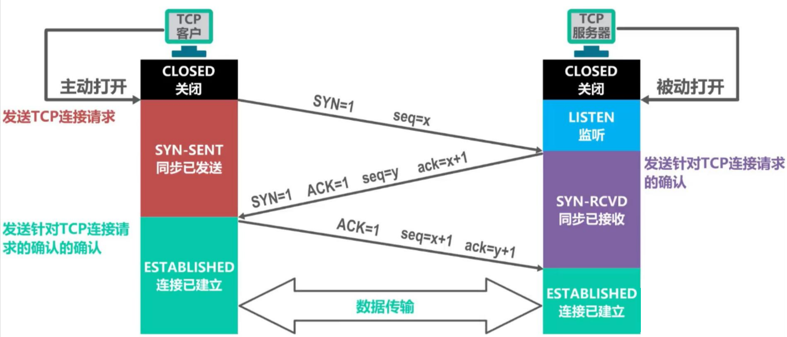

# 讲下TCP三次握手的过程？稍微详细些

第一次握手：

​	客户端向服务端发送连接请求，并进入`SYN_SEND`状态，报文中，SYN标志位设置为1，序列号seq是一个随机值，假定为x。（SYN=1,seq=x）；

第二次握手：

​	服务器收到客户端的请求以后，服务端响应，并进入`SYN_RCVD`状态；其中，报文内，SYN标志位为1，ACK标志位为1，ack确认号为客户端序列号加1，服务端也有一个随机序列号发送给客户端，假定为y（SYN=1,ACK=1,seq=y，ack=x+1）

第三次握手：

​	客户端收到服务端响应后，会再次向服务端发起确认响应，客户端进入`Establish`状态，其中，报文内，ACK标志位为1，序列号为服务端的随机序列号加1（ACK=1,seq=y+1）；

​	服务端收到确认包以后也会进入`Establish`状态；

图解：

## 两次握手会有什么问题？

​	不可以，第一次握手，可以让服务端确认客户端具有发送能力；第二次握手可以让客户端确认服务具备发送能力和接收能力。如果不进行第三次握手，服务端就无法确认客户端是否具有接收能力了。

​	另外，服务端也无法确认客户端是否已经接收到自己发送的初始序列号，如果第二次握手报文丢失，客户端就无法获取服务端的初始序列号，TCP的可靠性则无从谈起。

